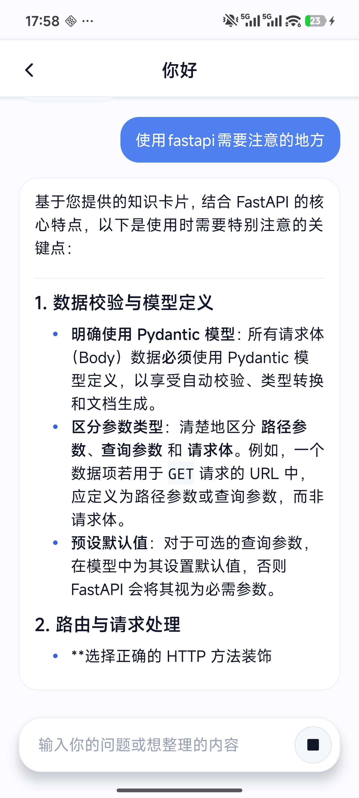
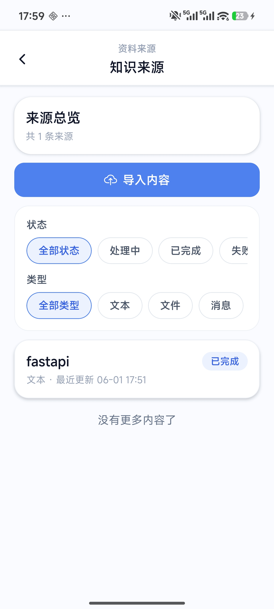
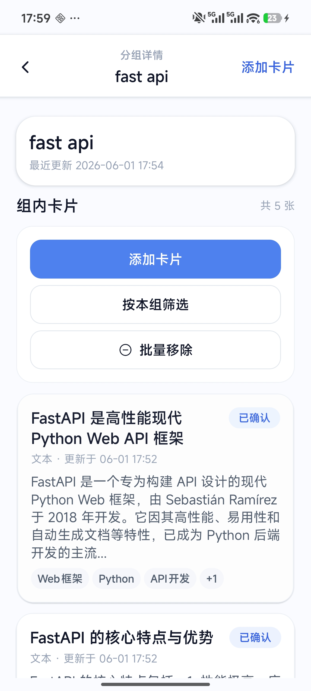
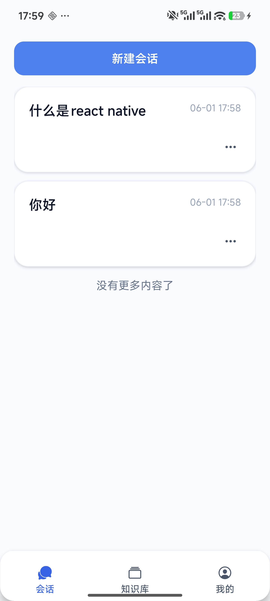
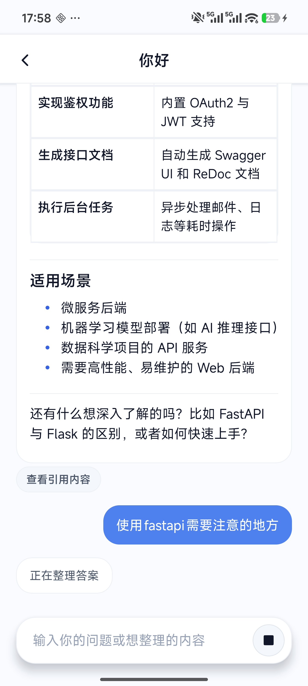
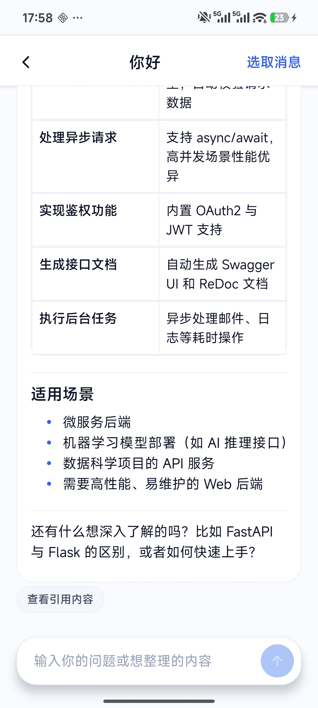
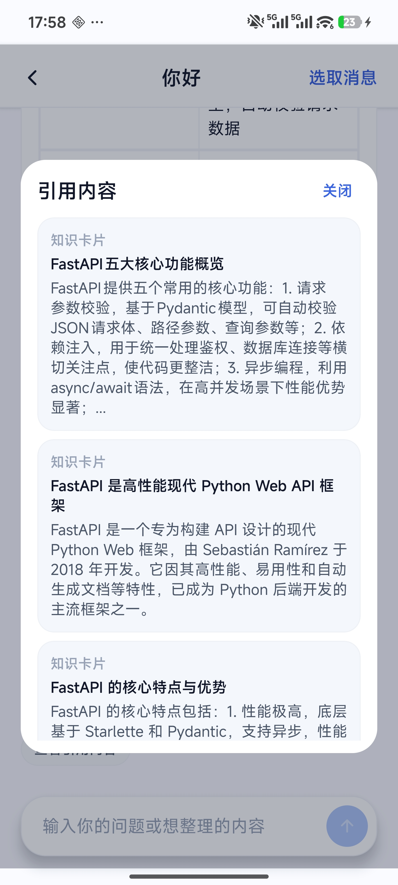
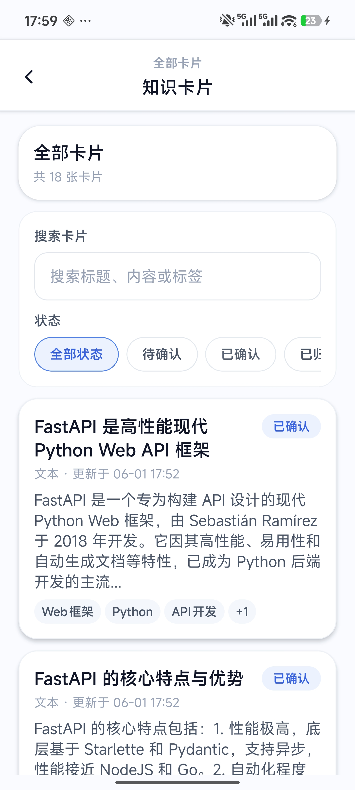
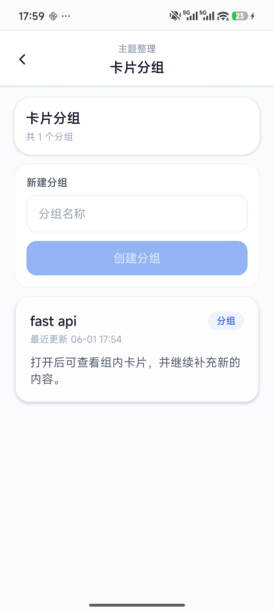
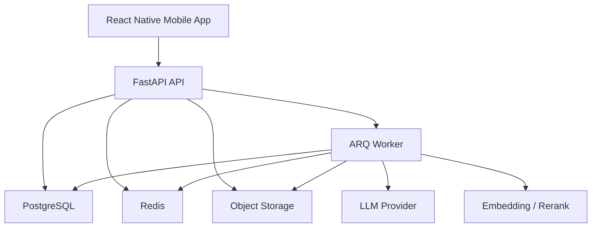

# 云笺智语 Yunjian Zhiyu

> 面向个人知识管理场景的 AI 知识助手。  
> 支持资料导入、知识卡片生成、检索增强问答，以及移动端流式对话体验。

<table>
  <tr>
    <td align="center"></td>
    <td align="center"></td>
    <td align="center"></td>
  </tr>
  <tr>
    <td align="center">知识增强问答</td>
    <td align="center">知识来源管理</td>
    <td align="center">卡片分组管理</td>
  </tr>
</table>

## 项目简介

云笺智语提供一条围绕个人资料沉淀与复用的知识工作流：将文本、文档和聊天内容导入系统，转换为结构化知识来源与知识卡片，再在对话场景中通过检索增强生成提供更稳定、可追溯的回答。

项目采用移动端与服务端分离架构：

- 移动端基于 React Native，提供会话、知识库、资料来源和卡片分组等核心页面
- 服务端基于 FastAPI，提供认证、聊天、知识处理、上传和分组管理等 API
- 异步任务基于 Redis 与 ARQ，承担聊天生成和知识处理链路
- 检索与生成链路结合向量检索、Rerank 和流式回答输出

## 核心特性

- `多来源知识导入`
  支持手动文本、文档文件和聊天消息三类知识来源。

- `知识卡片抽取`
  将原始资料切块、抽取、清洗并生成可管理的知识卡片。

- `检索增强问答`
  在会话中优先召回个人知识，再结合模型生成回答。

- `流式对话体验`
  支持消息增量返回、中间状态展示和生成中断。

- `知识组织与管理`
  支持卡片筛选、状态管理、分组整理和来源追踪。

- `异步处理链路`
  使用 ARQ Worker 解耦聊天生成、知识处理与主请求路径。

## 功能预览

### 会话与知识增强问答

<table>
  <tr>
    <td align="center"></td>
    <td align="center"></td>
    <td align="center"></td>
  </tr>
  <tr>
    <td align="center">会话列表</td>
    <td align="center">知识增强回答</td>
    <td align="center">流式生成状态</td>
  </tr>
  <tr>
    <td align="center"></td>
    <td align="center"></td>
    <td align="center"></td>
  </tr>
  <tr>
    <td align="center">消息选取导入</td>
    <td align="center">引用内容查看</td>
    <td align="center"></td>
  </tr>
</table>

### 知识库与资料来源

<table>
  <tr>
    <td align="center"></td>
    <td align="center"></td>
  </tr>
  <tr>
    <td align="center">知识库首页</td>
    <td align="center">知识来源列表</td>
  </tr>
</table>

### 卡片与分组管理

<table>
  <tr>
    <td align="center"></td>
    <td align="center"></td>
    <td align="center"></td>
  </tr>
  <tr>
    <td align="center">知识卡片</td>
    <td align="center">卡片分组</td>
    <td align="center">分组详情</td>
  </tr>
</table>

## 典型流程


## 技术栈

- `Mobile`: React Native, TypeScript, React Navigation, React Query, Redux Toolkit
- `Backend`: FastAPI, SQLAlchemy, Pydantic, Alembic
- `Async`: Redis, ARQ
- `Storage`: PostgreSQL, pgvector, Object Storage
- `LLM Workflow`: LangGraph, LangChain, OpenAI-compatible API

## 系统架构



## 仓库结构

```text
yunjian-zhiyu/
├── apps/
│   ├── mobile/   # React Native 客户端
│   └── server/   # FastAPI 后端服务
├── docs/
│   └── readme-assets/
├── docker-compose.yml
└── README.md
```

## 快速开始

### 1. 启动依赖服务

```bash
docker compose up -d
```

### 2. 初始化数据库

```bash
uv run --project apps/server alembic -c apps/server/alembic.ini upgrade head
```

### 3. 启动后端 API

```bash
pnpm dev:server
```

### 4. 启动 ARQ Worker

```bash
pnpm dev:worker
```

### 5. 启动移动端

直接运行 Android 客户端：

```bash
pnpm dev:mobile
```

单独启动 Metro：

```bash
pnpm --dir apps/mobile start
```

## 当前进展

当前版本已完成以下核心能力：

- 认证与登录态持久化
- 会话列表与聊天详情
- 流式消息展示与中断
- 知识来源创建与列表管理
- 知识卡片列表、状态与分组管理
- 从聊天消息导入知识来源
- 文档上传与异步知识处理
- 基于知识卡片的召回与重排

## License

This project is under active development. License information can be added here when ready.
